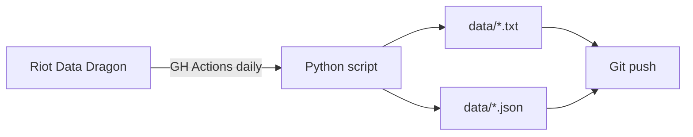

# league-items-spells

Auto-updated dataset of League of Legends items and spells in English and Russian.

Updates **daily at 6:00 UTC** via GitHub Actions from the [Riot Data Dragon API](https://developer.riotgames.com/docs/lol).

## Files

### Regular items (410 unique names)
| File | Format |
|---|---|
| `data/lol_items_en_ru.txt` | `English Name = Russian Name` |
| `data/items_en.txt` | English names only |
| `data/items_ru.txt` | Russian names only |

### Arena items (225 unique names)
| File | Format |
|---|---|
| `data/items_arena_en_ru.txt` | `English Name = Russian Name` |
| `data/items_arena_en.txt` | English names only |
| `data/items_arena_ru.txt` | Russian names only |

### Champion names (172)
| File | Format |
|---|---|
| `data/champions_en_ru.txt` | `English Name = Russian Name` |
| `data/champions_en.txt` | English names only |
| `data/champions_ru.txt` | Russian names only |
| `data/champions.json` | JSON: `{id, en_name, ru_name}` |

### Spells (876: 16 summoner + 860 champion abilities)
| File | Format |
|---|---|
| `data/spells_en.txt` | Spell names in English |
| `data/spells_ru.txt` | Spell names in Russian |
| `data/spells.json` | JSON: `{id, type, en_name, ru_name}` |

### Combined (all data in one file)
| File | Sections |
|---|---|
| `data/all_en.txt` | Regular items → Summoner Spells → Champion Abilities → Champions (EN) |
| `data/all_ru.txt` | Same in Russian |
| `data/all_en_ru.txt` | All EN = RU in one file |

### Raw data
| File | Format |
|---|---|
| `data/items.json` | All 700+ item entries (including duplicates by game mode) |
| `data/version.txt` | Current patch and update date |

## Usage for AI

Give an LLM the URL to `data/all_en_ru.txt` or `data/items.json` — it will be able to map Russian item names to English ones and suggest builds.

## How it works

